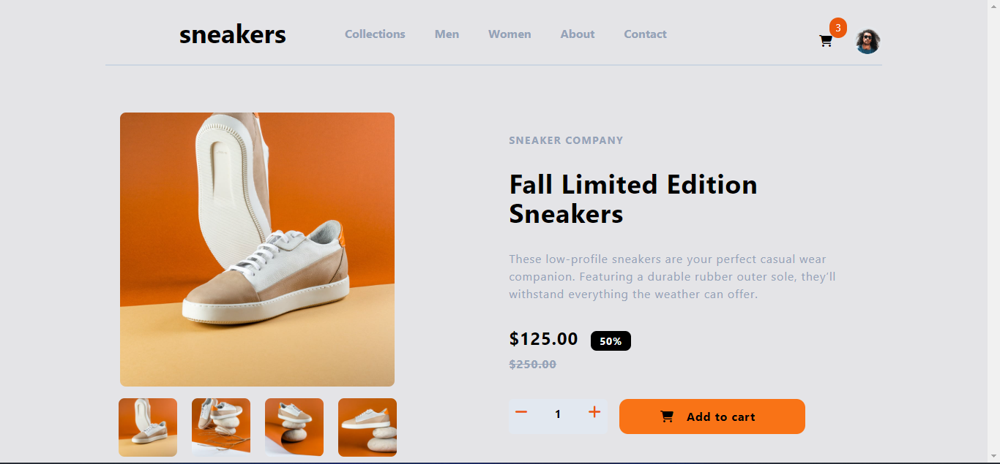

# Frontend Mentor - E-commerce product page solution

This is a solution to the [E-commerce product page challenge on Frontend Mentor](https://www.frontendmentor.io/challenges/ecommerce-product-page-UPsZ9MJp6). Frontend Mentor challenges help you improve your coding skills by building realistic projects.

## Table of contents

- [Overview](#overview)
  - [The challenge](#the-challenge)
  - [Screenshot](#screenshot)
  - [Links](#links)
- [My process](#my-process)
  - [Built with](#built-with)
  - [What I learned](#what-i-learned)
  - [Continued development](#continued-development)
  - [Useful resources](#useful-resources)
- [Author](#author)
- [Acknowledgments](#acknowledgments)

**Note: Delete this note and update the table of contents based on what sections you keep.**

## Overview

### The challenge

Users should be able to:

- View the optimal layout for the site depending on their device's screen size
- See hover states for all interactive elements on the page
- Open a lightbox gallery by clicking on the large product image
- Switch the large product image by clicking on the small thumbnail images
- Add items to the cart
- View the cart and remove items from it

### Screenshot



Add a screenshot of your solution. The easiest way to do this is to use Firefox to view your project, right-click the page and select "Take a Screenshot". You can choose either a full-height screenshot or a cropped one based on how long the page is. If it's very long, it might be best to crop it.

Alternatively, you can use a tool like [FireShot](https://getfireshot.com/) to take the screenshot. FireShot has a free option, so you don't need to purchase it. 

Then crop/optimize/edit your image however you like, add it to your project, and update the file path in the image above.

**Note: Delete this note and the paragraphs above when you add your screenshot. If you prefer not to add a screenshot, feel free to remove this entire section.**

### Links

- Solution URL: [Add solution URL here](https://github.com/Godbrand0/ecommerce-product-page-main)
- Live Site URL: [Add live site URL here](https://godbrand0.github.io/ecommerce-product-page-main/page.htm)

## My process

### Built with

- Semantic HTML5 markup
- tailwindCSS custom properties
- Flexbox

- Mobile-first workflow

- [TailwindCSS](https://tailwindcss.com/) - For styles

**Note: These are just examples. Delete this note and replace the list above with your own choices**

### What I learned

this project helped me in my understanding of tailwindcss and javascript, writing the add to cart function was a bit tricky but i had help.
```html
<h1>Some HTML code I'm proud of</h1>
```
```css

```
```js
function reloadCart() {
        const cartItems = document.getElementById('cart-items');
        
        cartItems.innerHTML = ''; 
         
        let totalItems = 0;

        for (const key in listCards) {
            const item = listCards[key];
            totalItems += item.quantity;

            const totalPrice = (item.quantity * item.price).toFixed(2);

            const itemElement = document.createElement('div');
            itemElement.className = 'cart-item';
            itemElement.innerHTML = `
                <div class="flex m-3 gap-10 flex-col">
                    <div class="flex  gap-4 items-center">
                        
                        <div class="flex gap-3">
                            <div class="text-sm text-gray-400">
                                <p class="">${item.name}</p>
                                <div class="flex">
                                    <p class="flex">${item.quantity} x $${item.price}</p>
                                    <span class="font-bold text-black mx-3">$${totalPrice}</span>
                                </div>
                                
                            </div>
                            
                            <i class="fa-solid fa-trash-can cursor-pointer text-gray-400" id="delete"></i>
                        </div>
                    </div>

                    <div class="bg-orange-500 py-3 px-14 rounded-xl text-center cursor-pointer hover:opacity-45 duration-150" id="" >
                        <i class="fa-solid fa-cart-shopping"></i> <span class="font-bold px-3 ">Checkout</span>
                    </div>
                </div>
                
                
            `;
            cartItems.appendChild(itemElement);
        }}
```

If you want more help with writing markdown, we'd recommend checking out [The Markdown Guide](https://www.markdownguide.org/) to learn more.

**Note: Delete this note and the content within this section and replace with your own learnings.**

### Continued development

i would like to continue my development in javascript.


## Author

- Website - [Add your name here](https://www.your-site.com)
- Frontend Mentor - [@yourusername](https://www.frontendmentor.io/profile/yourusername)
- Twitter - [@yourusername](https://www.twitter.com/yourusername)

**Note: Delete this note and add/remove/edit lines above based on what links you'd like to share.**

## Acknowledgments

This is where you can give a hat tip to anyone who helped you out on this project. Perhaps you worked in a team or got some inspiration from someone else's solution. This is the perfect place to give them some credit.

**Note: Delete this note and edit this section's content as necessary. If you completed this challenge by yourself, feel free to delete this section entirely.**
